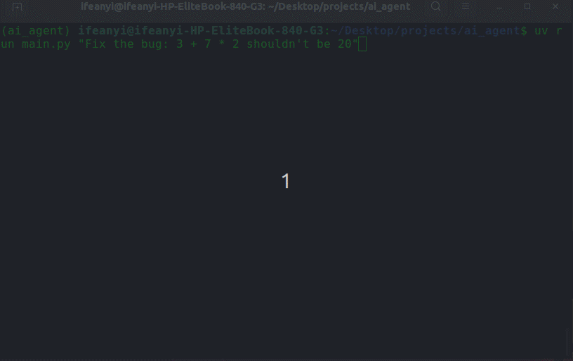

# Autonomous AI Coding Agent & Secure Execution Sandbox


An autonomous command-line agent built from scratch using Python and openRouter API with stateful multi-turn feedback loops, a dynamic tool-calling function registry, and a secure directory-sandboxed file execution engine.



### Motivation

Lately, there has been a massive shift toward autonomous AI coding assistants like Claude Code and Cursor. Watching how these tools operate sparked my curiosity. As an engineer, "magic" is just a system with the hood welded shut. I wanted to understand exactly what happens behind that curtain—how a model actually decides to run a terminal command, how it retains conversation state across multiple tasks, and how to stop it from spinning out into infinite, expensive token-burning loops. Instead of waiting to use a paid plan, I decided to build a lightweight version from scratch to pull back the curtain myself.

This project was built to demystify that workflow while tackling three concrete engineering constraints:
* **The Token Ceiling:** Runaway agent loops burn money fast. I built a lookahead file buffer stream that automatically flags and truncates massive assets at exactly 10,000 characters before the payload can exhaust the LLM context window.
* **The Security Boundary:** You can't let an autonomous agent roam free on your host machine. I implemented absolute path resolution and a strict `os.path.commonpath` wall to keep the agent entirely sandboxed within a target directory.
* **Deterministic Routing:** To keep the architecture predictable, I skipped bloated orchestration frameworks and mapped the tool layout using an extensible, type-hinted python `function_map` registry paired with dynamic `**kwargs` unpacking.

Ultimately, this project allowed me to reverse-engineer the core mechanics of modern agentic developer tools. By moving past basic API consumption, I gained a deep, practical understanding of how to manage multi-turn tool execution streams, state synchronization, and strict execution boundaries in a clean Python backend.


## 🚀 Quick Start

Follow these steps to set up the environment and run the agent locally.

### 1. 🛠️ Prerequisites

Ensure you have the following installed on your system:
* **Python 3.10+**
* **uv** (Modern Python package manager)
* A Unix-like terminal (Bash/Zsh)

### 2. 📦 Installation & Setup

Clone the repository and navigate into the project directory:
```bash
git clone https://github.com/KellsCodes/building-ai-agent.git
cd building-ai-agent
```

Create your local environment file:
```bash
cp .env.example .env
```
Open the `.env` file and paste your API key string:
```env
OPENROUTER_API_KEY="your_openrouter_api_key_here"
```

### 3. 💻 Running the Agent

Use `uv run` to automatically synchronize dependencies and launch the command-line interface.

**Ask the agent to investigate or fix a file:**
* Run this first to test the calculator function before running our agent:
```bash
uv run calculator/main.py "3 + 7 * 2"
```
Note the result.

**Go to `calculator/pkg/calculator.py and change the following line:**
```bash
self.precedence: dict[str, int] = {
            "+": 1,}
Change to:
self.precedence: dict[str, int] = {
            "+": 3,}
```

**Run the command to let the agent fix the code it detects on the calculator precedence**
```bash
uv run main.py "Fix the bug: 3 + 7 * 2 shouldn't be 20"
```
This will run and fix the code and write to the file and STDOUT on the steps its taken

```bash
uv run main.py "Explain how the calculator renders results to the console"
```

## 📖 Usage

Available flags:

- `--verbose` - For detailed routing logs about the agent execution and token usage

## 🤝 Contributing

Contributions are welcome! Whether you are fixing a bug, adding a new tool to the registry, or optimizing the agent loop, please follow these steps to maintain a clean codebase.

### 🚀 How to Contribute

1. **Fork the Repository** and create a descriptive feature branch:
   ```bash
   git checkout -b feat/your-awesome-feature
   ```
2. **Implement Your Changes** ensuring your functions remain decoupled and purely functional.
3. **Format & Lint Your Code** 🧼  
   All code must comply strictly with PEP 8 standards. Run Flake8 locally before committing to ensure there are no line-length or formatting violations:
   ```bash
   uv run flake8 .
   ```
4. **Run the Test Suite** ✅  
   Ensure all existing security sandboxing and truncation edge cases pass completely:
   ```bash
   * Test for file metadata reading:
   uv run test_get_file_content.py

   * Test for file content reading by character length:
   uv run test_get_files_info.py

   * Test for TestCalculator:
   uv run calculator/tests.py

   * Test for writing to files:
   uv run test_write_file.py

   * Test run script: 
   uv run test_run_python_file.py

   * Test function calls trigger:
   uv run main.py "what files are in the root?"
   uv run main.py "what files are in the pkg directory?"
   ```
5. **Commit Your Changes** 📝  
   Use the **Conventional Commits** standard (e.g., `feat:`, `fix:`, `docs:`) with short, imperative messages:
   ```bash
   git commit -m "feat(agent): add tool schema validation helper"
   ```
6. **Submit a Pull Request** against the `main` branch with a clear description of your modifications.

## 💡 Code Style Guidelines

* **Keep it Pure:** Keep agent utilities functional and side-effect-free wherever possible. Return diagnostic strings or error tags instead of raising unhandled exceptions into the core execution loop.
* **Respect the Line Limit:** Keep lines under 79 characters. Use parentheses for multi-line imports or implicit string concatenation for long prompt strings to keep Flake8 happy.
* **Keep the Sandbox Secure:** Any new tool that interacts with the filesystem must resolve absolute paths and cross-check operations against `os.path.commonpath`.
